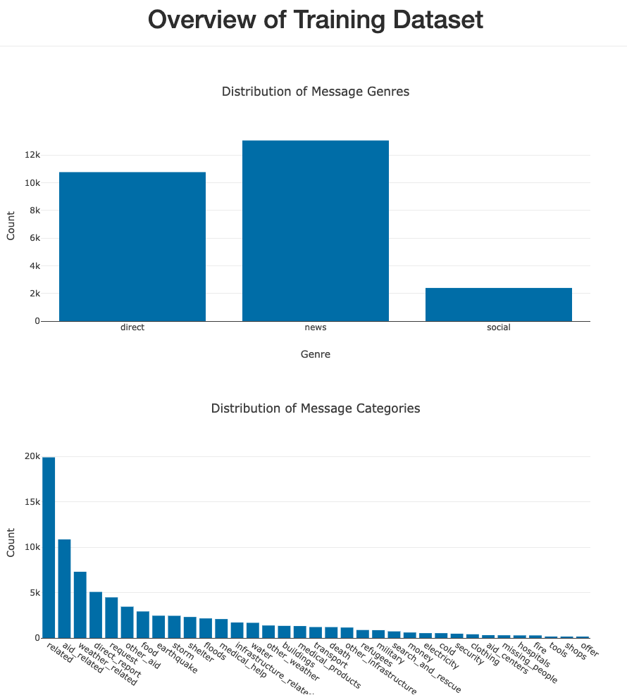
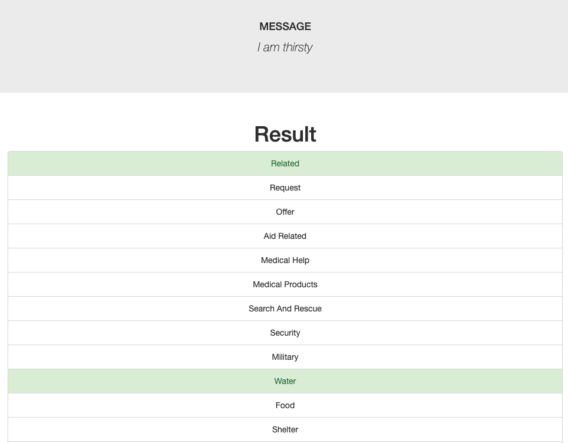

# Disaster Response Pipeline

### Table of Contents

1. [Installation](#installation)
2. [Project Motivation and description](#motivation)
3. [File Descriptions](#files)
4. [Instructions to execute the code](#instructions)
5. [Results](#results)
6. [Licensing](#licensing)
7. [Acknowledgements](#Acknowledgements)

## Installation 

1. Python 3.5+,
2. Library and packages: NumPy, SciPy, Pandas, Sciki-Learn, NLTK, SQLalchemy, Pickle, Flask, Plotly

## Project Motivation and description 

When disaster happens, it is important for the emergency worker to correctly classify the message categories such that corresponding disaster relief agencies can correctly react and provide relative supplies to help people or community after disaster.

In this project, I used the dataset containing tweets and messages from real-world disaster events provided by Figure Eight, processed and cleaned the data using ETL pipeline, employed a machine learning pipeline through natural language processing to build a model that can classify disaster messages in a web app.

## File Descriptions 

There are three main foleders:
1. data
    - disaster_messages.csv: dataset including all the messages
    - disaster_categories.csv: dataset including all the categories
    - process_data.py: ETL pipeline to read, clean, and store the data into a SQLite database
    - DisasterResponse.db: saved SQLite database with the cleaned data
2. models
    - train_classifier.py: machine learning pipeline to train and export the best classifier within the selected hyperparameters
    - classifier.pkl: output classifer of the machine learning pipeline
3. app
    - run.py: Flask file to run the web application
    - templates contains html files for the web app

    ## Instructions to execute the code:

    1. Run the following commands in the project's root directory to set up your database and model.

        - To run ETL pipeline that cleans data and stores in database
            `python data/process_data.py data/disaster_messages.csv data/disaster_categories.csv data/DisasterResponse.db`
        - To run ML pipeline that trains classifier and saves
            `python models/train_classifier.py data/DisasterResponse.db models/classifier.pkl`

    2. Run the following command in the app's directory to run your web app.
        `python run.py`

    3. Go to http://0.0.0.0:3001/

## Results

A web app with general data visualization that can classify the message disaster categories.

The web app is demonstrated in the following steps with screen captures

1. The web app main page shows Overview of the training dataset with two graphs: one demonstrated the distribution of message genres , and another for distribution of message categories

1. Enter a message to classify and click **Classify Message**

2. The following screen capture shows that the categories which the message belongs were highlighted in green in the Result

## License 

## Acknowledgements

Acknowledge to [Udacity](https://www.udacity.com/) for providing the starter code, and [Figure Eight](https://www.figure-eight.com/) for the data.

Acknowledge to a few repos I studied on Github: [[1]](https://github.com/canaveensetia/udacity-disaster-response-pipeline), [[2]](https://github.com/swang13/disaster-response-pipeline).
